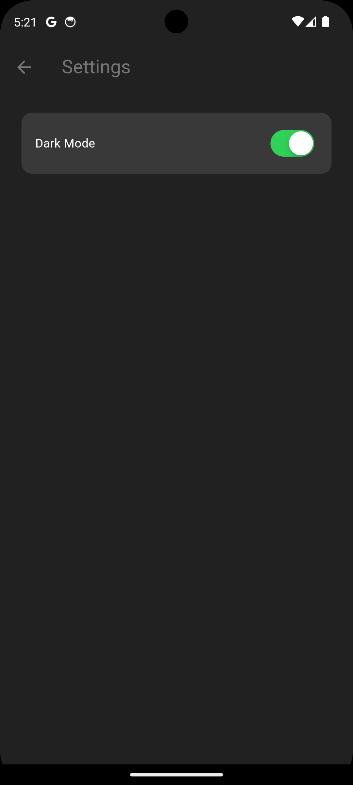

# minimal_chat

## What is it 🚀

As the name suggests its a minimalistic looking app that focuses on chatting mainly

## Reason for its creation 🤔

This project was born out of curiosity and a strong interest in learning Flutter's SDK.

Credit of this project goes to this youtube creator: https://www.youtube.com/watch?v=5xU5WH2kEc0

Although there was changes within the SDK itself so I still had to pull my own weight to get it up-to-date and working

## How to set it up 🛠

Prerequisites (*optional):

*Android Studio (and SDK tools installed) - Since it was developed on a android emu device it'll look at its best there 

Flutter SDK installed (Installation Guide)
https://docs.flutter.dev/get-started/install/windows/mobile

Dart installed
https://dart.dev/get-dart

Firebase -> https://youtu.be/5xU5WH2kEc0?si=5_ACNFgnzq4bUCav&t=922

Since I credited his work, and I won't explain it any better

Clone this repository:

git clone https://github.com/ToasterRepo/minimal_chat.git

cd minimal_chat

Install dependencies:

flutter pub get

Run the app:

flutter run

## What it does 🎯

Message Between different users, that's it

## App in action 📷

## Tech Stack 🔧

Flutter

Dart

## Is it a ever growing project? 🤝

It was merely a project to learn flutter's SDK and its quirks, you're free to grab it and mess with it, not meant for further development though.
